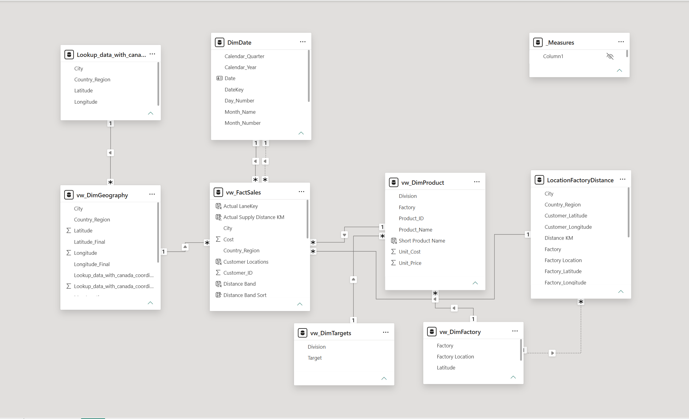
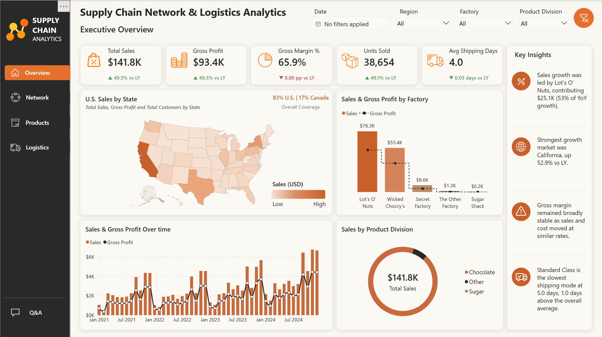
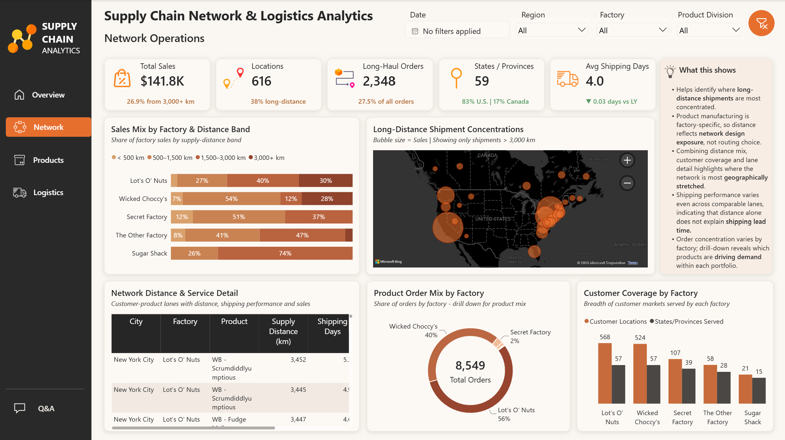
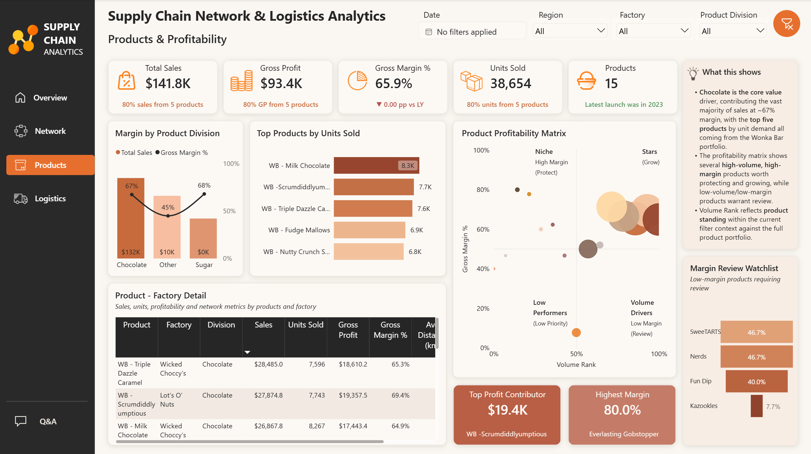
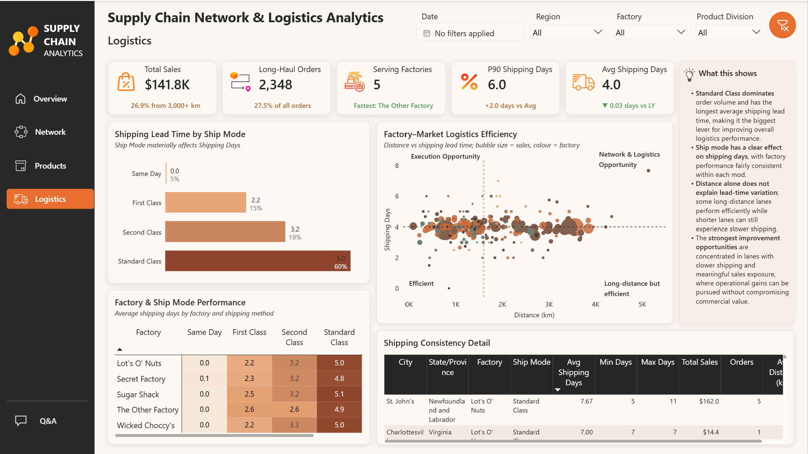

# Supply Chain Network & Logistics Analytics

An end-to-end supply chain analytics project built using **SQL Server and Power BI** to analyze sales performance, factory coverage, product profitability, supply-distance exposure, and shipping efficiency across a U.S. and Canadian distribution network.

The project goes beyond reporting totals by connecting **commercial performance with network and logistics decisions** — identifying where sales and profit are concentrated, where the supply network is geographically stretched, and where shipping performance warrants further investigation.

---

## Project Overview

The analysis is based on the **Maven Analytics US Candy Distributor dataset**.

The solution was developed through:

**Raw Data → SQL Staging Layer → Analytical SQL Views → Power BI Data Model → DAX Measures → Interactive Dashboard**

The final report contains four analytical pages:

1. **Executive Overview**
2. **Network Operations**
3. **Products & Profitability**
4. **Logistics**

---

## Business Questions

The dashboard was designed to answer questions such as:

- Which factories and customer markets generate the most sales and gross profit?
- Where is the distribution network most geographically stretched?
- How concentrated are sales, profit, and demand across the product portfolio?
- Which products combine strong volume and profitability?
- Which products require margin review?
- How do shipping days vary by ship mode and factory?
- Which factory–market combinations show potential logistics-efficiency opportunities?
- Where can logistics performance be improved while protecting sales and margin?

---

## Data Preparation & SQL

A SQL staging and analytical layer was created before connecting the data to Power BI.

Key transformations included:

- Created dedicated staging tables for factories, products, sales, targets, and U.S. ZIP-code reference data.
- Built analytical views for Fact Sales, Product, Factory, Geography, and Targets.
- Standardized numeric data types for Sales, Cost, Gross Profit, and Units.
- Created a reusable Date dimension for time-intelligence analysis.
- Corrected a systematic source-data anomaly in `Ship_Date` by adjusting dates by **2,000 days**.
- Calculated `Shipping_Days` from Order Date to corrected Ship Date.
- Enriched customer geography with coordinates.
- Calculated factory-to-customer supply distance using the **Haversine formula**.
- Created supply-distance bands for network exposure analysis.

SQL scripts are available in the [`sql`](sql/) folder.

---

## Data Model

The Power BI model follows a fact-and-dimension structure with relationships between:

- Fact Sales
- Date
- Product
- Factory
- Geography
- Targets
- Factory–Customer Distance

The model was designed with predominantly **single-direction relationships** to maintain predictable filtering and avoid ambiguous filter paths.



---

## Dashboard Pages

### 1. Executive Overview

Provides an executive view of commercial and operational performance including:

- Total Sales
- Gross Profit
- Gross Margin
- Units Sold
- Average Shipping Days
- Sales geography
- Factory performance
- Sales and profit trends
- Product division mix



---

### 2. Network Operations

Analyzes how the manufacturing and customer network is geographically distributed.

Key views include:

- Factory sales mix by supply-distance band
- Long-distance shipment concentrations
- Customer coverage by factory
- Product order mix by factory
- Customer-product lane detail

A key analytical consideration is that **products are factory-specific in this dataset**. Therefore, distance is interpreted as **network design exposure**, rather than evidence that demand can simply be reassigned to the nearest factory.



---

### 3. Products & Profitability

Evaluates product demand, profitability, and portfolio concentration.

Key analyses include:

- Margin by product division
- Top products by units sold
- Product profitability matrix
- Product–factory economics
- Margin review watchlist
- Pareto concentration analysis

The Pareto measures dynamically calculate how many products are required to generate **80% of Sales, Gross Profit, and Units Sold** within the current filter context.



---

### 4. Logistics

Focuses on shipping lead-time performance and operational consistency.

Key analyses include:

- Average Shipping Days
- P90 Shipping Days
- Long-Haul Orders
- Serving Factories
- Shipping lead time by Ship Mode
- Factory × Ship Mode performance
- Factory–Market Logistics Efficiency
- Shipping consistency detail

The Factory–Market Logistics Efficiency matrix compares **supply distance and average shipping days**, while bubble size represents Sales, helping identify areas where logistics improvement may have meaningful commercial impact.



---

## Key Findings

- **$141.8K** in total sales generated **$93.4K** in gross profit at a **65.9% gross margin**.
- Approximately **27% of sales** are associated with supply distances above **3,000 km**.
- **2,348 orders**, or approximately **27.5% of total orders**, are long-haul orders above 3,000 km.
- The network serves **616 customer locations** across **59 states/provinces**.
- Around **80% of Sales, Gross Profit, and Units Sold are generated by only five products**, highlighting significant portfolio concentration.
- **Standard Class accounts for approximately 60% of orders** and has the longest average shipping lead time at approximately **5 days**.
- Overall Average Shipping Days are approximately **4.0**, while **P90 Shipping Days are 6.0**, highlighting a slower tail of order performance.
- Factory performance is relatively consistent within each Ship Mode, indicating that **shipping method is a stronger driver of shipping time than factory alone**.
- Distance alone does not explain shipping performance: some long-distance lanes operate efficiently while some shorter-distance lanes experience slower shipping.

---

## Tools & Skills Demonstrated

### SQL Server
- Data staging
- Analytical views
- Data type standardization
- Date dimension creation
- Data-quality correction
- Fact and dimension preparation

### Power BI
- Data modeling
- Power Query
- DAX
- Time intelligence
- Dynamic KPI measures
- Pareto analysis
- Percentile analysis
- Conditional formatting
- Interactive slicers and drill-down
- Scatter and matrix analysis
- Dashboard UX/UI design

### Supply Chain Analytics
- Spend and sales analysis
- Product profitability
- Factory performance
- Customer coverage
- Supply-distance analysis
- Logistics lead-time analysis
- Network exposure
- Shipping-mode performance
- Portfolio concentration

---

## Analytical Assumptions & Limitations

- `Ship_Date` contained a systematic date anomaly and was corrected by subtracting 2,000 days before calculating Shipping Days.
- Shipping Days represent **Order Date to Ship Date**, not customer delivery time.
- No formal SLA or promised delivery date is available; therefore, longer shipping times are described as slower performance rather than "late" shipments.
- Each product is manufactured by a specific factory in the available dataset. Nearest-factory analysis therefore cannot be treated as an immediately feasible reassignment recommendation.
- The Targets table does not contain a time period, so target-versus-actual performance was not forced into the analysis.
- Geographic distance represents straight-line Haversine distance rather than actual road or carrier routing distance.

---

## Repository Structure

```text
supply-chain-network-logistics-analytics/
│
├── README.md
│
├── dashboard/
│   └── Supply_Chain_Network_Logistics_Analytics.pbix
│
├── images/
│   ├── 01_Executive_Overview.png
│   ├── 02_Network_Operations.png
│   ├── 03_Products_Profitability.png
│   ├── 04_Logistics.png
│   └── 05_Data_Model.png
│
├── sql/
│   ├── 01_staging.sql
│   ├── 02_analytical_views.sql
│   └── 03_dim_date.sql
│
├── docs/
│   └── methodology.md
│
└── data/
    └── README.md
